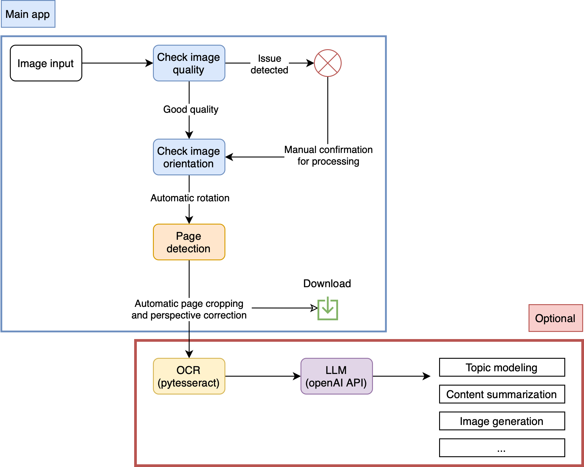

# TUMO Workshop - Preserving the Past with AI

<p align="center">

</p>

This Git contains main code and tasks for the TUMO workshop "Preserving the Past with AI", led by Chahan Vidal-Gorène (Calfa) and Baptiste Queuche (Calfa). Done in partnership with the National Library of Armenia.

<p align="center">
   
</p>

## Case Study: Document enhancement and post-processing
The goal is to deal with digitizations of newspapers done by the National Library: quality assessment, image enhancement, document classification.

### Course obj. 1 : explore and discover AI techniques with Python
Develop and train-eval computer vision model from scratch, building datasets, install packages, defining annotation strategies, prompt engineering for document analysis and heritage materials (YOLO, LabelStudio).

### Course obj. 2 : project development experience
Developing an AI-based program for the National Library of Armenia, using Streamlit, YOLO and openAI API.



## Installation and running

```bash
git clone https://github.com/CVidalG/workshop-TUMO2025.git
cd workshop-TUMO2025/app/
python3 -m venv app-enhancement
source app-enhancement/bin/activate
pip install numpy opencv-python Pillow streamlit ultralytics openai pytesseract
```

Make sure to have `tesseract-ocr` installed on your computer.

then

```bash
streamlit run main.py
```

### Models and openAI API
You can change models in `config.py` and set your openAI api key in `config.py`.
You need an openAI API key to run the LLM part (optional).

## How to cite

To cite this work, you can use:

```
TUMO Students. (2025). Preserving the Past with AI [GitHub repository]. Supervised by Chahan Vidal-Grorène & Baptiste Queuche, Calfa. https://github.com/CVidalG/workshop-TUMO2025.git
```

Or to use the following bibtex:

```
@misc{abc2025project,
  author       = {TUMO Students},
  title        = {Preserving the Past with AI},
  year         = {2025},
  howpublished = {\url{https://github.com/CVidalG/workshop-TUMO2025.git}},
  note         = {Supervised by Chahan Vidal-Gorène and Baptiste Queuche, Calfa},
}
```