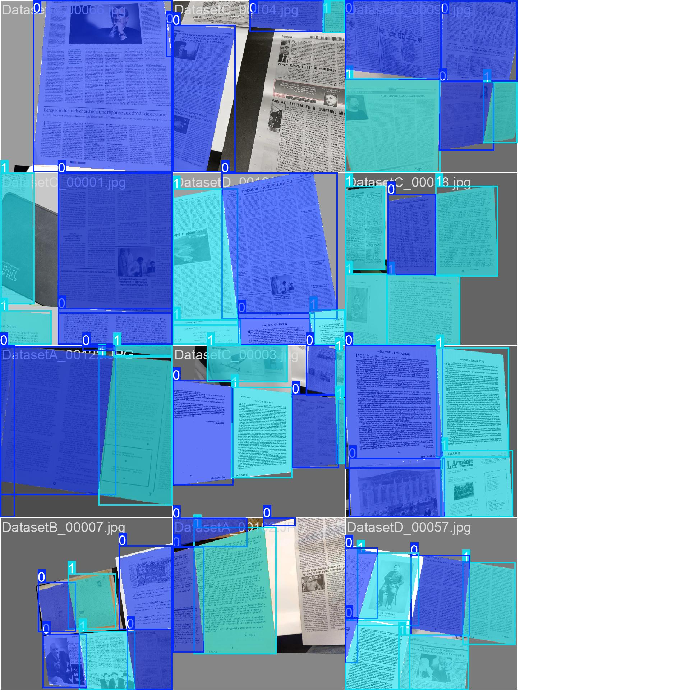

# Classification and detection models

## Page detection

Parameters:
```yaml
model: yolo11n-seg
epochs: 300
batch: 12
imgsz: 860
seed: 42
cos_lr: true
dropout: 0.05
augment: false
degrees: 10
translate: 0
scale: 0.5
shear: 0.05
perspective: 0.0005
flipud: 0
fliplr: 0
bgr: 0.1
mosaic: 1.0
mixup: 0
copy_paste: 0.0
```

Train batch:
<p align="center">

</p>